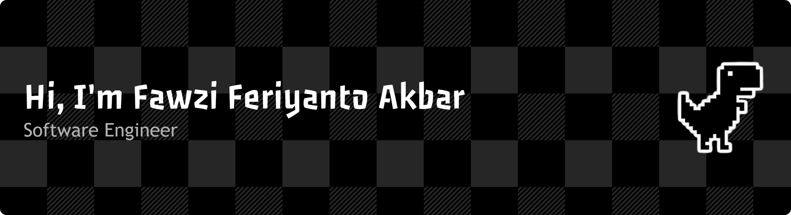

<h1 align="center">
  
  𝐇𝐞𝐥𝐥𝐨, &lt;𝚌𝚘𝚍𝚎𝚛𝚜/&gt;!
  
</h1>

# 💫 About Me:
🔭 I’m currently working on my personal portfolio site and interactive web projects on GitHub Pages.  👯 I’m looking to collaborate on beginner-friendly coding projects and web apps.  🤔 I’m looking for help with backend concepts, APIs, and deployments.  🌱 I’m currently learning React, JavaScript frameworks, and full-stack basics.  💬 Ask me about getting started with web dev, GitHub Pages, or being a tech student in Jakarta!  ⚡ Fun fact: I live by "Stay hungry, Stay foolish" and love blending tech with exploring my city!

## 🌐 Socials:
    

# 💻 Tech Stack:
                                                            
<!-- # 📊 GitHub Stats:
 
 

## 🏆 GitHub Trophies
 -->

### ✍️ Random Dev Quote

<picture>
  <source media="(prefers-color-scheme: dark)" srcset="https://raw.githubusercontent.com/Dumpxrepo/Dumpxrepo/output/pacman-contribution-graph-dark.svg">
  
</picture>

<!-- <picture>
  <source media="(prefers-color-scheme: dark)" srcset="https://raw.githubusercontent.com/Dumpxrepo/Dumpxrepo/output/pacman-contribution-graph-dark.svg">
  <source media="(prefers-color-scheme: light)" srcset="https://raw.githubusercontent.com/Dumpxrepo/Dumpxrepo/output/pacman-contribution-graph.svg">
  
</picture> -->

###

---

  

<!-- Proudly created with GPRM ( https://gprm.itsvg.in ) -->
